# 库存管理系统模块依赖关系与实施计划

## 模块依赖关系图

```mermaid
graph TD
    M4[模块4: 用户权限系统] --> M1[模块1: 库存管理]
    M4 --> M2[模块2: 位置管理]
    M4 --> M3[模块3: 采购订单]
    M4 --> M5[模块5: 供应商管理]
    
    M2 --> M1
    M5 --> M1
    M5 --> M3
    
    M1 --> M6[模块6: 系统设置]
    M3 --> M6
    M5 --> M6
    
    M1 --> M7[模块7: 报表分析]
    M3 --> M7
    M5 --> M7
    
    style M4 fill:#e1f5fe
    style M1 fill:#fff3e0
    style M3 fill:#f3e5f5
    style M7 fill:#e8f5e8
```



## 核心依赖说明

### 基础层 (Foundation Layer)
- **模块4 (用户权限)**: 所有模块的基础，提供认证和授权
- **模块2 (位置管理)**: 为库存物品提供存储位置支持
- **模块5 (供应商管理)**: 为库存和采购提供供应商数据

### 核心层 (Core Layer)  
- **模块1 (库存管理)**: 系统核心，依赖用户、位置、供应商
- **模块3 (采购订单)**: 采购流程，依赖用户、供应商，与库存关联

### 管理层 (Management Layer)
- **模块6 (系统设置)**: 数据管理，依赖所有核心业务模块
- **模块7 (报表分析)**: 数据分析，依赖所有业务数据

---

## 详细实施计划

## Phase 1: 基础设施强化 (2-3周)
**状态**: 🟢 大部分已完成，需要增强

### Week 1-2: 核心基础完善
**模块4: 用户权限系统增强**
- [x] 基础认证系统 (已完成)
- [ ] 细粒度权限控制
- [ ] 用户组管理
- [ ] 操作审计日志

**模块2: 位置管理优化**  
- [x] 基础层级位置 (已完成)
- [ ] 位置容量管理
- [ ] 位置利用率统计
- [ ] 可视化位置树

**模块5: 供应商管理基础**
- [x] 基础供应商模型 (已完成)
- [ ] 供应商评级系统
- [ ] 联系人管理
- [ ] 供应商文档

### 优先级任务清单
```sql
-- 数据库结构增强
-- 1. 用户权限表
CREATE TABLE user_permissions (
    id SERIAL PRIMARY KEY,
    user_id INTEGER REFERENCES users(id),
    permission VARCHAR(64) NOT NULL,
    granted_at TIMESTAMP DEFAULT CURRENT_TIMESTAMP,
    granted_by_user_id INTEGER REFERENCES users(id)
);

-- 2. 位置容量管理
ALTER TABLE locations ADD COLUMN max_capacity INTEGER;
ALTER TABLE locations ADD COLUMN capacity_unit VARCHAR(32);

-- 3. 供应商联系人
CREATE TABLE supplier_contacts (
    id SERIAL PRIMARY KEY,
    supplier_id INTEGER REFERENCES suppliers(id),
    name VARCHAR(128) NOT NULL,
    title VARCHAR(64),
    email VARCHAR(128),
    phone VARCHAR(32),
    is_primary BOOLEAN DEFAULT FALSE,
    created_at TIMESTAMP DEFAULT CURRENT_TIMESTAMP
);
```

---

## Phase 2: 核心功能增强 (3-4周)

### Week 3-4: 库存管理核心
**模块1: 库存管理增强**

#### 1.1 物品列表界面重构
**优先级**: P0 (关键路径)
```html
<!-- 新的物品列表界面 -->
<div class="inventory-management">
    <!-- 搜索与筛选栏 -->
    <div class="search-filter-bar">
        <div class="global-search">
            <input type="text" id="globalSearch" placeholder="搜索物品名称、编号、CAS号...">
            <button class="search-btn"><i class="fas fa-search"></i></button>
        </div>
        
        <div class="filters">
            <select id="locationFilter" data-placeholder="选择位置">
                <option value="">所有位置</option>
                
                <option value="{{ location.id }}">{{ location.full_path }}</option>
                
            </select>
            
            <select id="supplierFilter" data-placeholder="选择供应商">
                <option value="">所有供应商</option>
                
                <option value="{{ supplier.id }}">{{ supplier.name }}</option>
                
            </select>
            
            <select id="statusFilter">
                <option value="">所有状态</option>
                <option value="Available">可用</option>
                <option value="Low Stock">库存不足</option>
                <option value="Expired">已过期</option>
            </select>
            
            <button class="advanced-filter-toggle">高级筛选</button>
        </div>
    </div>
    
    <!-- 高级筛选面板 -->
    <div class="advanced-filters collapse" id="advancedFilters">
        <div class="filter-row">
            <label>到期日期范围:</label>
            <input type="date" id="expiryFrom" placeholder="开始日期">
            <input type="date" id="expiryTo" placeholder="结束日期">
        </div>
        
        <div class="filter-row">
            <label>库存数量范围:</label>
            <input type="number" id="quantityMin" placeholder="最小数量">
            <input type="number" id="quantityMax" placeholder="最大数量">
        </div>
        
        <div class="filter-actions">
            <button class="btn-apply-filters">应用筛选</button>
            <button class="btn-clear-filters">清除筛选</button>
        </div>
    </div>
    
    <!-- 操作工具栏 -->
    <div class="toolbar">
        <div class="view-controls">
            <button class="view-toggle active" data-view="table">
                <i class="fas fa-table"></i> 表格视图
            </button>
            <button class="view-toggle" data-view="cards">
                <i class="fas fa-th-large"></i> 卡片视图
            </button>
        </div>
        
        <div class="bulk-actions">
            <button class="btn-export">导出数据</button>
            <button class="btn-import">批量导入</button>
            <button class="btn-add-item btn-primary">添加物品</button>
        </div>
    </div>
    
    <!-- 表格视图 -->
    <div class="table-view" id="tableView">
        <table class="inventory-table" id="inventoryTable">
            <thead>
                <tr>
                    <th><input type="checkbox" id="selectAll"></th>
                    <th data-sort="name">物品名称 <i class="fas fa-sort"></i></th>
                    <th data-sort="catalog_number">编号</th>
                    <th data-sort="supplier">供应商</th>
                    <th data-sort="current_quantity">当前库存</th>
                    <th data-sort="minimum_quantity">最小库存</th>
                    <th data-sort="location">位置</th>
                    <th data-sort="expiration_date">到期日期</th>
                    <th data-sort="status">状态</th>
                    <th>操作</th>
                </tr>
            </thead>
            <tbody id="inventoryTableBody">
                <!-- 动态加载数据 -->
            </tbody>
        </table>
        
        <!-- 分页控件 -->
        <div class="pagination-controls">
            <div class="page-info">
                显示 <span id="startItem">1</span> - <span id="endItem">20</span> 
                共 <span id="totalItems">0</span> 项
            </div>
            <div class="pagination">
                <!-- 分页按钮 -->
            </div>
        </div>
    </div>
    
    <!-- 卡片视图 -->
    <div class="cards-view hidden" id="cardsView">
        <div class="inventory-cards" id="inventoryCards">
            <!-- 动态加载卡片 -->
        </div>
    </div>
</div>
```

#### 1.2 高级搜索功能实现
```python
# 后端搜索API
@bp.route('/api/search')
@login_required
def api_search():
    """高级搜索API"""
    query = request.args.get('q', '')
    location_id = request.args.get('location')
    supplier_id = request.args.get('supplier') 
    status = request.args.get('status')
    expiry_from = request.args.get('expiry_from')
    expiry_to = request.args.get('expiry_to')
    quantity_min = request.args.get('quantity_min')
    quantity_max = request.args.get('quantity_max')
    
    page = int(request.args.get('page', 1))
    per_page = int(request.args.get('per_page', 20))
    sort_by = request.args.get('sort_by', 'name')
    sort_order = request.args.get('sort_order', 'asc')
    
    # 构建查询
    query_obj = InventoryItem.query
    
    # 全文搜索
    if query:
        search_filter = or_(
            InventoryItem.name.ilike(f'%{query}%'),
            InventoryItem.catalog_number.ilike(f'%{query}%'),
            InventoryItem.cas_number.ilike(f'%{query}%'),
            InventoryItem.description.ilike(f'%{query}%')
        )
        query_obj = query_obj.filter(search_filter)
    
    # 位置筛选
    if location_id:
        query_obj = query_obj.filter(InventoryItem.location_id == location_id)
    
    # 供应商筛选  
    if supplier_id:
        query_obj = query_obj.filter(InventoryItem.supplier_id == supplier_id)
    
    # 状态筛选
    if status:
        query_obj = query_obj.filter(InventoryItem.status == status)
    
    # 到期日期筛选
    if expiry_from:
        query_obj = query_obj.filter(InventoryItem.expiration_date >= datetime.strptime(expiry_from, '%Y-%m-%d').date())
    if expiry_to:
        query_obj = query_obj.filter(InventoryItem.expiration_date <= datetime.strptime(expiry_to, '%Y-%m-%d').date())
    
    # 数量范围筛选
    if quantity_min:
        query_obj = query_obj.filter(InventoryItem.current_quantity >= float(quantity_min))
    if quantity_max:
        query_obj = query_obj.filter(InventoryItem.current_quantity <= float(quantity_max))
    
    # 排序
    sort_column = getattr(InventoryItem, sort_by, InventoryItem.name)
    if sort_order == 'desc':
        sort_column = sort_column.desc()
    query_obj = query_obj.order_by(sort_column)
    
    # 分页
    items = query_obj.paginate(
        page=page, 
        per_page=per_page, 
        error_out=False
    )
    
    # 序列化数据
    result = {
        'items': [{
            'id': item.id,
            'name': item.name,
            'catalog_number': item.catalog_number,
            'supplier_name': item.supplier_info.name if item.supplier_info else '',
            'current_quantity': item.current_quantity,
            'minimum_quantity': item.minimum_quantity,
            'unit': item.unit,
            'location_path': item.location_info.full_path if item.location_info else '',
            'expiration_date': item.expiration_date.isoformat() if item.expiration_date else None,
            'status': item.status,
            'is_low_stock': item.is_low_stock,
            'is_expired': item.is_expired
        } for item in items.items],
        'pagination': {
            'page': items.page,
            'pages': items.pages,
            'per_page': items.per_page,
            'total': items.total,
            'has_next': items.has_next,
            'has_prev': items.has_prev
        }
    }
    
    return jsonify(result)
```

### Week 5-6: 采购流程基础
**模块3: 采购与订单管理**

#### 3.1 购物车功能实现
```python
# 购物车模型 (已在计划中定义)
class ShoppingCart(db.Model):
    __tablename__ = 'shopping_cart'
    id = db.Column(db.Integer, primary_key=True)
    user_id = db.Column(db.Integer, db.ForeignKey('users.id'), nullable=False)
    item_name = db.Column(db.String(255), nullable=False)
    catalog_number = db.Column(db.String(128))
    supplier_id = db.Column(db.Integer, db.ForeignKey('suppliers.id'))
    quantity = db.Column(db.Float, nullable=False)
    estimated_price = db.Column(db.Float)
    notes = db.Column(db.Text)
    created_at = db.Column(db.DateTime, default=datetime.utcnow)

# 购物车API
@bp.route('/api/cart', methods=['GET', 'POST', 'DELETE'])
@login_required 
def shopping_cart_api():
    if request.method == 'GET':
        # 获取用户购物车
        cart_items = ShoppingCart.query.filter_by(user_id=current_user.id).all()
        return jsonify([{
            'id': item.id,
            'item_name': item.item_name,
            'catalog_number': item.catalog_number,
            'supplier_name': item.supplier_info.name if item.supplier_info else '',
            'quantity': item.quantity,
            'estimated_price': item.estimated_price,
            'notes': item.notes
        } for item in cart_items])
    
    elif request.method == 'POST':
        # 添加到购物车
        data = request.get_json()
        cart_item = ShoppingCart(
            user_id=current_user.id,
            item_name=data['item_name'],
            catalog_number=data.get('catalog_number'),
            supplier_id=data.get('supplier_id'),
            quantity=data['quantity'],
            estimated_price=data.get('estimated_price'),
            notes=data.get('notes')
        )
        db.session.add(cart_item)
        db.session.commit()
        return jsonify({'success': True, 'id': cart_item.id})
```

---

## Phase 3: 高级功能开发 (3-4周)

### Week 7-8: 数据管理与报表
**模块6: 系统设置和数据**

#### 6.1 批量导入导出功能
```python
# 导入导出服务 (已在计划中定义)
class DataImportExportService:
    @staticmethod
    def export_template():
        """生成导入模板"""
        template_data = {
            'columns': [
                '物品名称*', '产品编号', '供应商*', '当前数量*', 
                '单位*', '最小库存', '到期日期', '存储位置', 
                'CAS号', '批次号', '备注'
            ],
            'example_data': [
                ['抗体XYZ', 'AB12345', 'ThermoFisher', '10', 'mL', '2', '2024-12-31', 'Room101>Fridge>Shelf1', '12345-67-8', 'LOT001', '实验用']
            ]
        }
        return template_data
    
    @staticmethod
    def validate_import_data(df):
        """验证导入数据"""
        errors = []
        required_columns = ['物品名称', '供应商', '当前数量', '单位']
        
        # 检查必需列
        missing_columns = [col for col in required_columns if col not in df.columns]
        if missing_columns:
            errors.append(f"缺少必需列: {', '.join(missing_columns)}")
        
        # 验证数据
        for index, row in df.iterrows():
            if pd.isna(row.get('物品名称')):
                errors.append(f"第{index+2}行: 物品名称不能为空")
            
            try:
                float(row.get('当前数量', 0))
            except (ValueError, TypeError):
                errors.append(f"第{index+2}行: 当前数量必须是数字")
        
        return errors
```

### Week 9-10: 智能分析
**模块7: 报表与分析**

#### 7.1 消耗分析算法
```python
class ConsumptionAnalyzer:
    @staticmethod
    def predict_reorder_point(item_id, confidence_level=0.95):
        """预测再订货点"""
        # 获取历史消耗数据
        usage_history = UsageLog.query.filter(
            UsageLog.item_id == item_id,
            UsageLog.quantity_change < 0,
            UsageLog.timestamp >= datetime.utcnow() - timedelta(days=90)
        ).order_by(UsageLog.timestamp).all()
        
        if len(usage_history) < 5:
            return None  # 数据不足
        
        # 计算日消耗率
        daily_consumption = []
        for i in range(1, len(usage_history)):
            days_diff = (usage_history[i].timestamp - usage_history[i-1].timestamp).days
            if days_diff > 0:
                consumption_rate = abs(usage_history[i].quantity_change) / days_diff
                daily_consumption.append(consumption_rate)
        
        if not daily_consumption:
            return None
        
        # 计算统计指标
        mean_consumption = statistics.mean(daily_consumption)
        std_consumption = statistics.stdev(daily_consumption) if len(daily_consumption) > 1 else 0
        
        # 考虑供应商交货周期
        item = InventoryItem.query.get(item_id)
        lead_time = 7  # 默认7天，可以从供应商信息获取
        
        # 安全库存 = (z值 * 标准差 * sqrt(交货期)) + (平均消耗 * 交货期)
        z_score = 1.96 if confidence_level == 0.95 else 1.65  # 95%或90%置信度
        safety_stock = (z_score * std_consumption * (lead_time ** 0.5)) + (mean_consumption * lead_time)
        
        reorder_point = safety_stock + (mean_consumption * lead_time)
        
        return {
            'reorder_point': round(reorder_point, 2),
            'safety_stock': round(safety_stock, 2),
            'average_daily_consumption': round(mean_consumption, 2),
            'lead_time_days': lead_time,
            'confidence_level': confidence_level
        }
```

---

## Phase 4: 系统优化与集成 (2-3周)

### Week 11-12: 性能优化
- [ ] 数据库查询优化
- [ ] 缓存策略实施  
- [ ] 前端性能优化
- [ ] API响应时间优化

### Week 13: 集成测试
- [ ] 模块间集成测试
- [ ] 用户接受度测试
- [ ] 性能压力测试
- [ ] 安全性测试

---

## Phase 5: 部署与上线 (1-2周)

### Week 14-15: 生产部署
- [ ] 生产环境配置
- [ ] 数据迁移脚本
- [ ] 监控告警设置
- [ ] 用户培训材料
- [ ] 系统文档完善

---

## 关键里程碑

### 🎯 Milestone 1 (Week 4): 核心库存功能完成
- 增强版物品列表界面
- 高级搜索和筛选
- 物品详情页优化
- 位置管理完善

### 🎯 Milestone 2 (Week 8): 采购流程上线
- 购物车功能
- 申请审批工作流
- 订单管理系统
- 供应商管理增强

### 🎯 Milestone 3 (Week 12): 数据分析就绪
- 批量导入导出
- 基础报表功能
- 消耗分析算法
- 预警系统优化

### 🎯 Milestone 4 (Week 15): 系统全面上线
- 生产环境部署
- 用户培训完成
- 监控系统运行
- 技术文档齐全

---

## 风险控制

### 技术风险
- **数据迁移风险**: 制定详细的数据备份和回滚方案
- **性能风险**: 提前进行压力测试，优化关键查询
- **集成风险**: 分模块渐进式集成，避免大爆炸式发布

### 业务风险  
- **用户接受度**: 分阶段发布，收集用户反馈及时调整
- **数据一致性**: 实施严格的数据验证和约束
- **权限控制**: 细粒度权限测试，确保数据安全

### 缓解措施
- 每个Phase结束进行代码评审
- 关键功能100%测试覆盖
- 生产环境监控和告警
- 定期数据备份和恢复演练

---

这个详细的实施计划基于您现有的优秀基础架构，提供了清晰的开发路径和时间规划。每个阶段都有具体的技术实现方案和验收标准，可以确保项目按时高质量交付。